# 🎾 PadelHub

> **La gestión de clases de pádel, en tu bolsillo.**  
> Aplicación móvil multiplataforma que conecta profesores particulares y alumnos en una única plataforma digital.

---

## 📱 ¿Qué es PadelHub?

PadelHub nace para resolver un problema real: los profesores de pádel gestionan sus clases con grupos de WhatsApp, hojas de cálculo y listas en papel. PadelHub digitaliza ese flujo completo en una sola app: grupos, calendario, asistencia, alumnos y pagos, todo sincronizado en tiempo real.

Desarrollada como **Trabajo de Fin de Ciclo** del Grado Superior en Desarrollo de Aplicaciones Multiplataforma (Universidad Francisco de Vitoria, 2024–2026).

---

## ✨ Funcionalidades principales

### Rol Profesor

- 📋 **Gestión de grupos** — Crea grupos con nivel, horario, plazas, precio y ubicación. El sistema genera clases automáticamente con proyección de 3 meses.
- 📅 **Calendario semanal** — Visualiza todas las clases programadas y navega por semanas.
- ✅ **Control de asistencia** — Marca alumnos como presente/ausente. Al marcar "presente" se genera un pago automáticamente.
- 👥 **Gestión de alumnos** — Listado completo con ficha individual, historial de asistencia y pagos, y opción de archivar.
- 💰 **Dashboard económico** — Métricas de ingresos totales, pendientes, barra de progreso pagado/pendiente y gestor de transacciones con filtros.
- 🔔 **Notificaciones** — Solicitudes de nuevos alumnos y avisos de pagos recibidos.

<p align="center">
  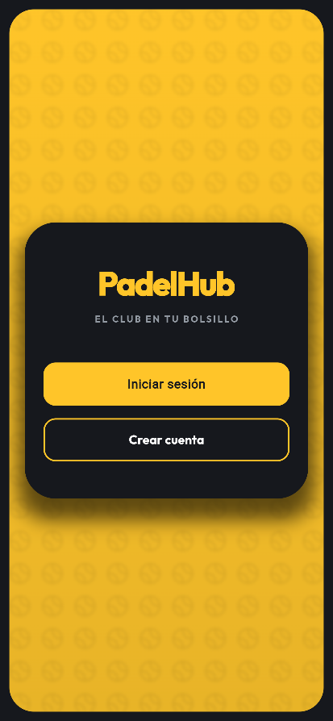
  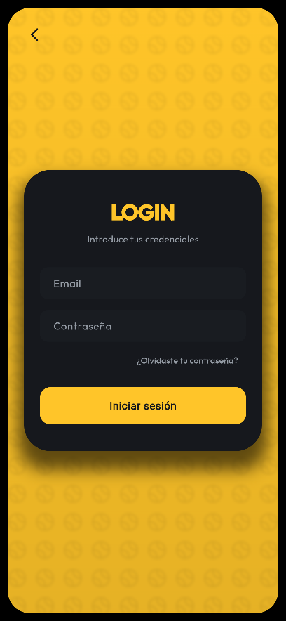
  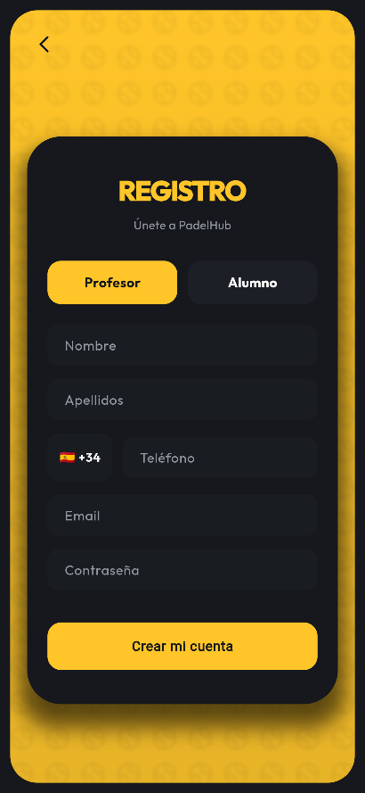
  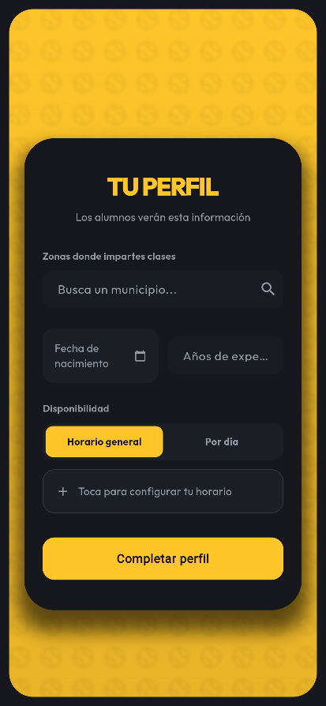
</p>
<p align="center"><i>Flujo de autenticación y onboarding del profesor</i></p>

<p align="center">
  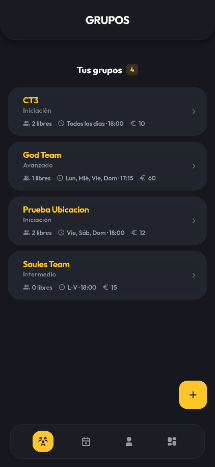
  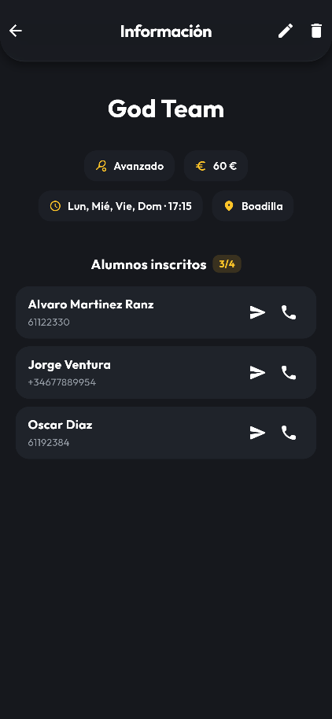
  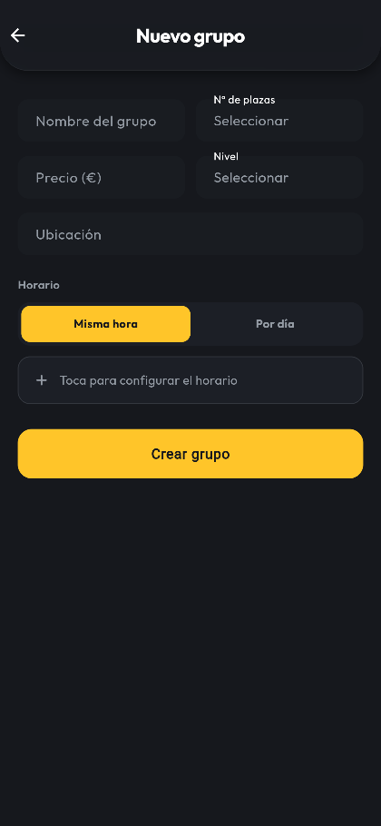
</p>
<p align="center"><i>Gestión de grupos</i></p>

<p align="center">
  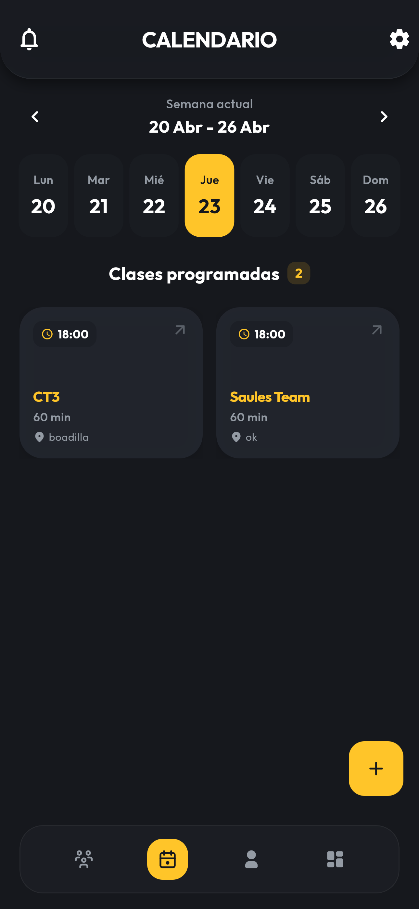
  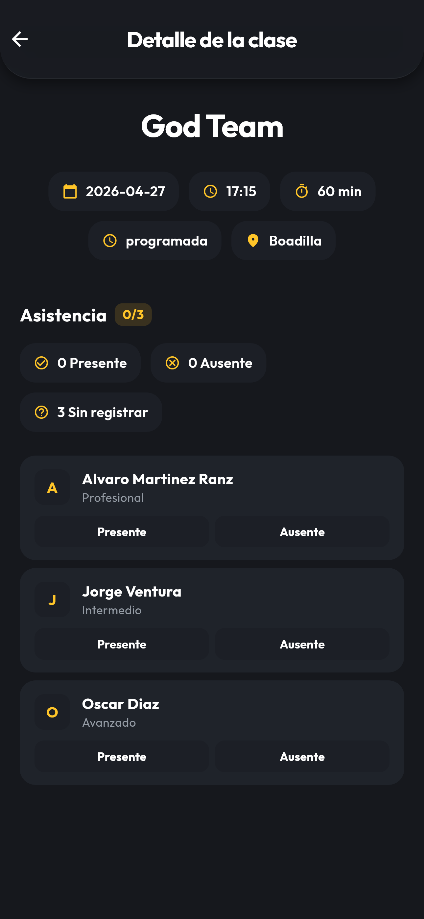
  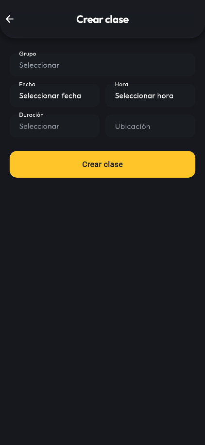
  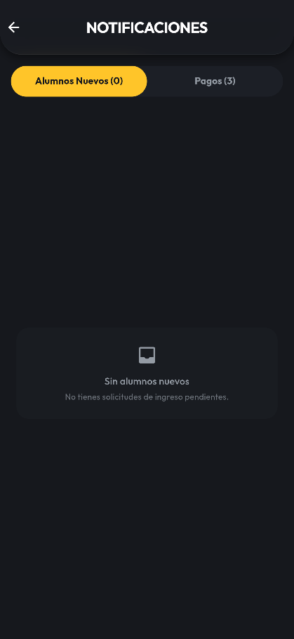
</p>
<p align="center"><i>Calendario, detalle de clase y notificaciones</i></p>

<p align="center">
  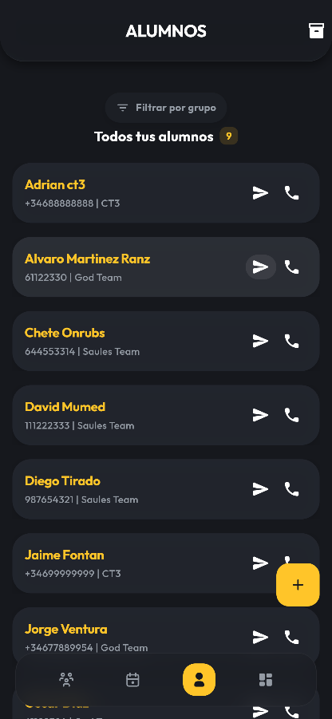
  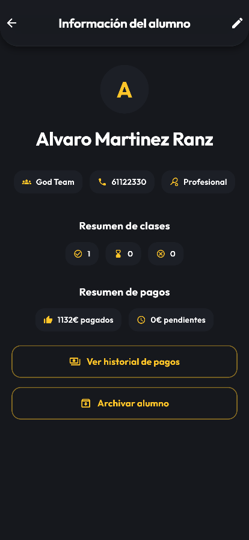
  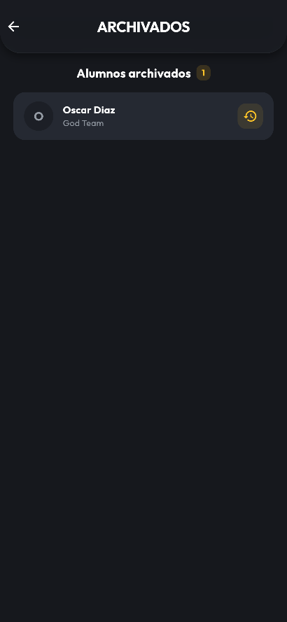
</p>
<p align="center"><i>Gestión de alumnos</i></p>

<p align="center">
  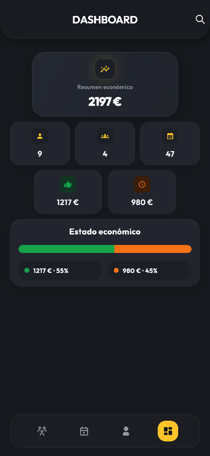
  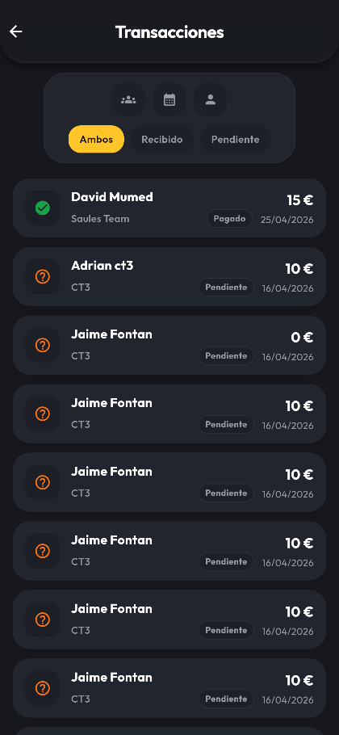
  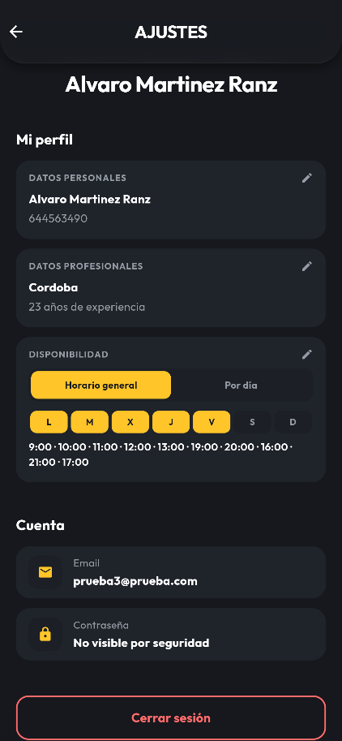
</p>
<p align="center"><i>Dashboard económico, transacciones y ajustes</i></p>

---

### Rol Alumno

- 🔍 **Directorio de profesores** — Búsqueda geográfica de profesores disponibles en tu zona, con perfil detallado (experiencia, horario, disponibilidad).
- 📩 **Solicitud de inscripción** — Envía una solicitud al profesor indicando nivel, días y horas preferidas.
- 📅 **Calendario personal** — Vista semanal de tus clases con estado de asistencia y opción de confirmar o cancelar.
- 💳 **Pagos con Stripe** — Paga las clases directamente desde la app de forma segura.
- 📊 **Dashboard personal** — Resumen económico mensual, historial de pagos y proyección de gasto.

<p align="center">
  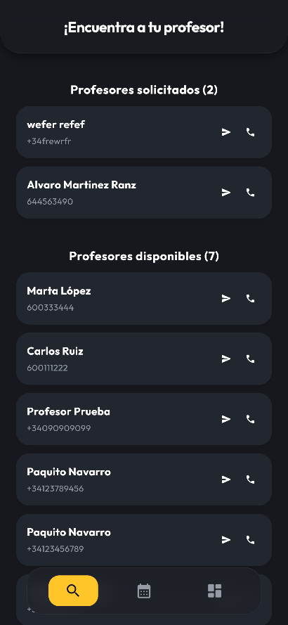
  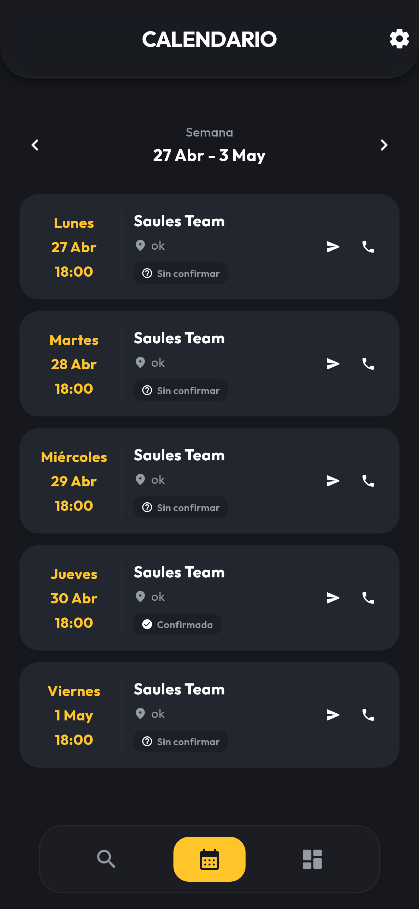
  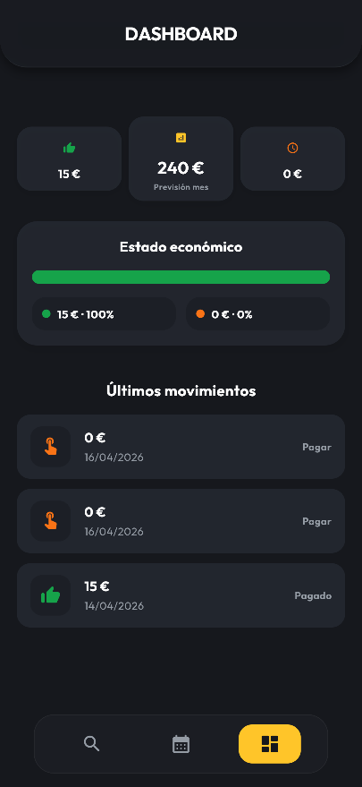
</p>
<p align="center"><i>Directorio de profesores, calendario y dashboard del alumno</i></p>

---

## 🛠️ Stack tecnológico

| Capa | Tecnología |
|------|-----------|
| Framework | [Flutter](https://flutter.dev) |
| Lenguaje | Dart |
| Backend & Base de datos | [Supabase](https://supabase.com) (PostgreSQL) |
| Autenticación | Supabase Auth |
| Pasarela de pagos | [Stripe](https://stripe.com) |
| Control de versiones | Git + GitHub |
| Gestión del proyecto | Trello (Kanban) |

### Dependencias principales

```yaml
supabase_flutter: ^2.0.0
flutter_stripe: latest
flutter_svg: ^2.0.10+1
url_launcher: ^6.2.5
intl_phone_field: ^3.2.0
flutter_launcher_icons: ^0.13.1
```

---

## 🗄️ Modelo de datos

La base de datos en Supabase (PostgreSQL) se compone de 7 tablas principales:

```
profesores ──< grupos ──< clases ──< asistencias
                    └──< alumnos ──< pagos
perfiles_alumnos ──< solicitudes_clase
```

**Flujo clave:** al marcar asistencia como *presente*, el sistema genera automáticamente un registro en la tabla `pagos` con estado `pendiente`. Cuando el alumno paga con Stripe, el estado cambia a `pagado` y el profesor recibe una notificación.

---

## 🏗️ Arquitectura

- **Patrón:** Monolito modular con organización **feature-first** (carpetas por módulo/funcionalidad).
- **Gestión de estado:** `setState` + `StatefulWidget` nativo de Flutter, sin librerías externas.
- **Sincronización:** En tiempo real mediante Supabase Realtime.
- **Fusión de cuentas:** Si un profesor creó previamente un alumno con el mismo teléfono, el sistema fusiona los registros automáticamente al registrarse el alumno.

---

## 🎨 Diseño

- **Estilo visual:** Glassmorfismo con dark mode.
- **Fondo:** `#16181D`
- **Color de acento:** `#FFC529` (amarillo)
- **Tipografía:** Outfit (Regular / Medium / SemiBold / Bold)
- **Iconografía:** SVG personalizados para la barra de navegación.

---

## 📂 Estructura de ramas

| Rama | Descripción |
|------|-------------|
| `main` | Rama principal estable |
| `Rama-diseño` | Primera iteración del diseño visual |
| `Rama_Diseño_V2` | Segunda iteración, integrada en main |
| `Diseño_Alumno` | Desarrollo de vistas y funcionalidades del alumno |

---

## 🚀 Estado del proyecto

La aplicación está **en fase de finalización** y prevista para publicación en Google Play Store y App Store en los próximos meses.

**Próximas funcionalidades planificadas:**
- 💬 Chat integrado entre profesor y alumno
- 📈 Estadísticas y progreso técnico del alumno
- ⭐ Sistema de valoraciones y reseñas de profesores
- 💼 Modelo freemium con suscripción Premium para profesores

---

## 👨‍💻 Autor

**Álvaro Martínez Ranz**  
Técnico Superior en Desarrollo de Aplicaciones Multiplataforma  
Universidad Francisco de Vitoria — Curso 2024–2026

[](https://www.linkedin.com/in/alvaro-martinez-ranz-629131269)
[](https://github.com/alvaromartinezranz)

---

> *Proyecto desarrollado con Flutter + Supabase + Stripe como TFC del ciclo DAM.*
